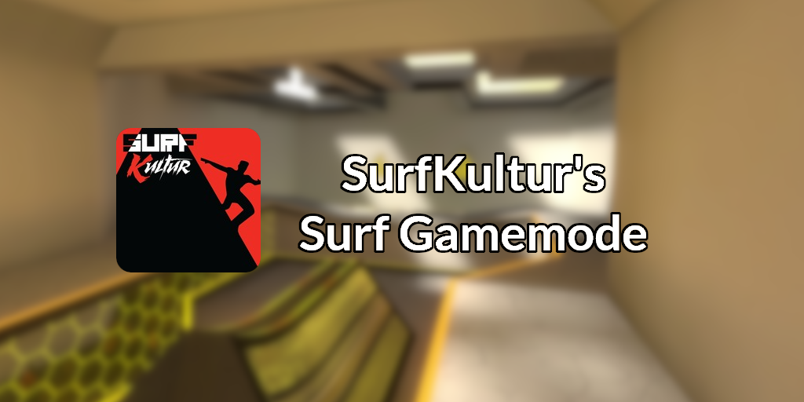

# SurfKultur's Surf Gamemode
This gamemode is a successor of Gravious' Flow Network Release v7.26, which you can find [using this link](https://github.com/GMSpeedruns/Flow-Release). I would personally like to thank Gravious for all of his hard work on this gamemode as this release would not be possible without him. If you really like this gamemode you should definitely check out his newer gamemode release which may interest you [using this link](https://github.com/GMSpeedruns/GM-SkillGamemode).

This version of the gamemode has been heavily modified and optimized for the Skill Surf gametype, meaning other gamemodes such as Bunny Hop are officially **NOT SUPPORTED** on this release. It comes with some welcome additions that are not present on the official release, which includes the following:
- Stage timer support
- Preset HUD themes
- Chat message colors for timer messages and more
- Settings menu with too many client customizability options
- More admin commands and options within the admin menu
- Many map fixes for maps that are known to break
- Profile menu for players
- Lag fixes

and so much more to list...

## Gamemode Backstory
This gamemode first started development back when I was in High School and started learning the very basics of programming back in 2015. I was surfing at the time and was actively playing on Prestige Gaming, a gaming community that is no longer around in Garry's Mod. I had completed every map on Prestige Gaming and was patiently waiting for more maps to come out to better improve my surf skills but it was then learned that the servers had gone abandoned since Gravious was no longer able to add maps, and unfortunately nobody was able to take their spot. The servers had started getting stale and I still wanted to play surf on Garry's Mod, so I was looking around for a way to play surf on Garry's Mod. I came across the Flow Network gamemode and put it on my local server, and I was able to learn how to add maps, zone them, and get times on maps that weren't available on the Prestige Gaming servers. While it did the very basics for surfing it was still missing many features that were present on the pG gamemode, notably stage timer support. So being a beginner at programming I slowly learned the Lua language and started making my own modifications to the gamemode, which is allowed based on the LICENSE provided on the gamemode file. Time had passed by and then I had the idea of making my own public surf server, one that could be maintained better and have active development happening. The Stellar Surf community was then born and fortunately it's still alive which is now starting to be one of the oldest surfing communities to still exist today.

In 2016 the gamemode was transferred to the SurfKultur clan, which a user named TheShoxter (or Priest) helped keep running for the next 2 years. Many things were added in this time, such as a reworked timer system and much needed optimizations to the stage timer I horribly created back in 2015. Around this time we started running into an issue that other Flow Network based gamemodes eventually run into, server lag/freezes. The official release uses sqlite to store times and many other stuff even when you use MySQL which can cause many issues when you have many records stored in the local database. We eventually transferred all of our sqlite stuff into a dedicated MySQL database server which eliminated all lag from the server while retaining all existing records. We were the only server with a Flow Release that was able to stay running without issues with sqlite.

Development did stop temporarily for a year back in 2019 when I got busy with many things IRL and the community was on the verge of dying out, but luckily two people named ArcticPanda and Aart helped revive the servers and features started being added quickly. In 2020 I had the opportunity to take ownership of the servers again and rename the branding back to Stellar Surf, which is the gamemode branding you see today. Over the course of a few years more features started getting added and we were slowly becoming the server to go to for surf competition. Today, this gamemode is competitive focused and has all of the features you want for a competitive surf server.

## Why am I releasing this?
I am now abandoning this gamemode as I think it's time to move on from this base and create something entirely new based on the experience I have as a programmer now. Stellar Movement Mod (smmod) is the future gamemode that the Stellar Surf community will be using and will be the next major thing to happen to Garry's Mod surf. For now, I think this gamemode will suffice for server owners that want to try something new and that is feature packed compared to alternative options. There are some issues with this gamemode that I never got around to fixing but these should be easy to fix, I was just too lazy to get around to it. I don't want to throw away the hard work I put to this over the years so I think this release would be nice for someone who wants to just look at it or even use it on their server. If you do consider using this on your server or appreciate the work I put into it, thank you so much.

# IMPORTANT DISCLAIMER
This gamemode has works that have not been touched in many years, some of which I created back when I first started programming. As such you'll notice some ugly stuff in this repository that I never got around to fixing, so please be aware of what you are getting into if you want to start making modifications of your own.

# Prerequisites
You will need a MySQL database server, preferrably a locally hosted one since you'll be making many connections to it at a time if you have a busy server. You will also need the MySQLOO module to use the MySQL functionality for this gamemode, [which can be found here](https://github.com/FredyH/MySQLOO).

# Installation
Get started by getting the repository files first. Go to the releases page on the right side or [click this link to get to it](https://github.com/Niflheimrx/surfkultur-surf/releases). Find the latest release and click on `Source code` within the Assets tab, whichever one you want to grab is your preference.

Once you have the repo files you can extract the gamemode to your server. Inside your `/gamemodes/` folder in your Garry's Mod directory create a new folder called `surf`, so your new directory should be `/gamemodes/surf/`. Extract every file from the repo to this folder.

Once extracted, you should navigate to the `/gamemodes/surf/gamemode/` directory and open both the `core.lua` and `core_data.lua` files. In the `core.lua` file change the `GM.DisplayName`, `_C["ServerName"]`, and `_C["Identifier"]` to whatever you'd like. In the `core_data.lua` file scroll down until you see something about MySQL credentials, it should be in an table called `SQLDetails`. Fill out your MySQL credentials there as needed and save both files.

Once saved, finish off the installation by importing the preset `flow_gmod.sql` file to your database server. This step can vary based on your host so just find a way that works best, phpmyadmin is preferred. Once imported you should have a database file with empty tables.

Once imported, run the server once and check for any errors. You should be able to join in-game and on your first join it should print that you have connected to the server for the first time. If you get MySQL errors check your MySQL credentials in `core_data.lua`. If you are not sure you can fix it, just send a new issue on the repository so I can help out if needed.

Congratulations, you now have the surf server up and running! All you need to do is make yourself an admin and start adding maps and zone them. This process is the same for the original flow release, so check out the full setup tutorial [using this link](https://youtu.be/P0ejz_nhYjY?t=673). You can also find the tutorial to zone maps [using this link](https://www.youtube.com/watch?v=j3c4XypOZF0).

Again thank you for checking this out and thank you Gravious for making all of this possible ♥
